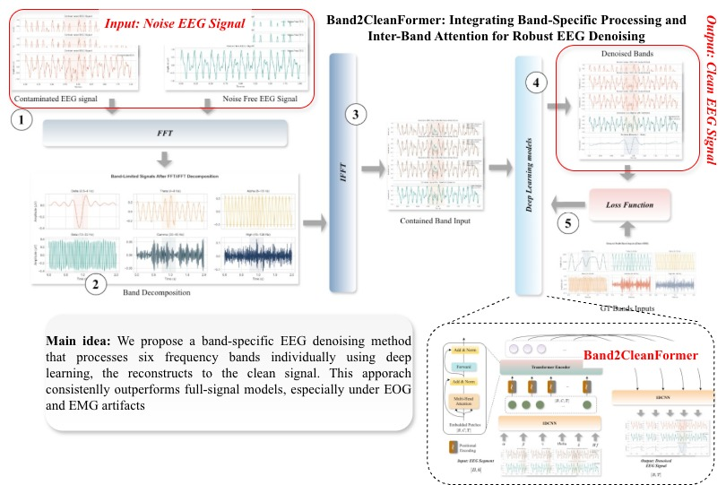
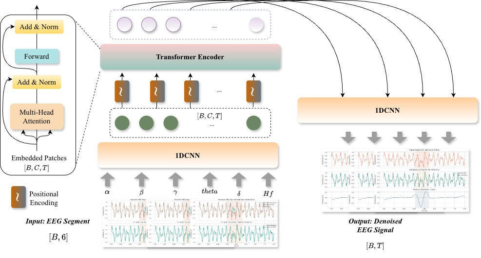
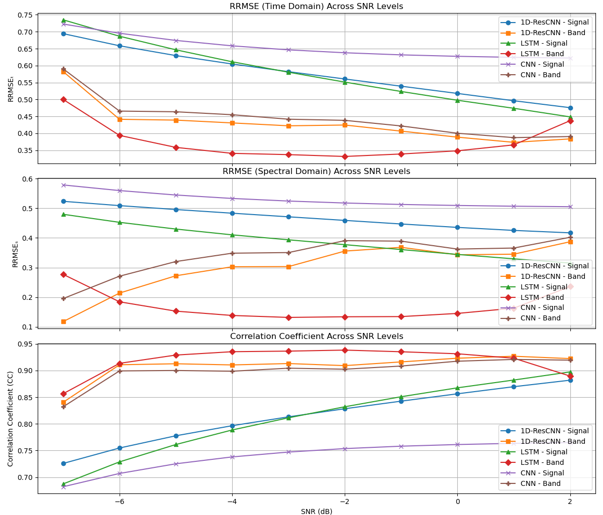
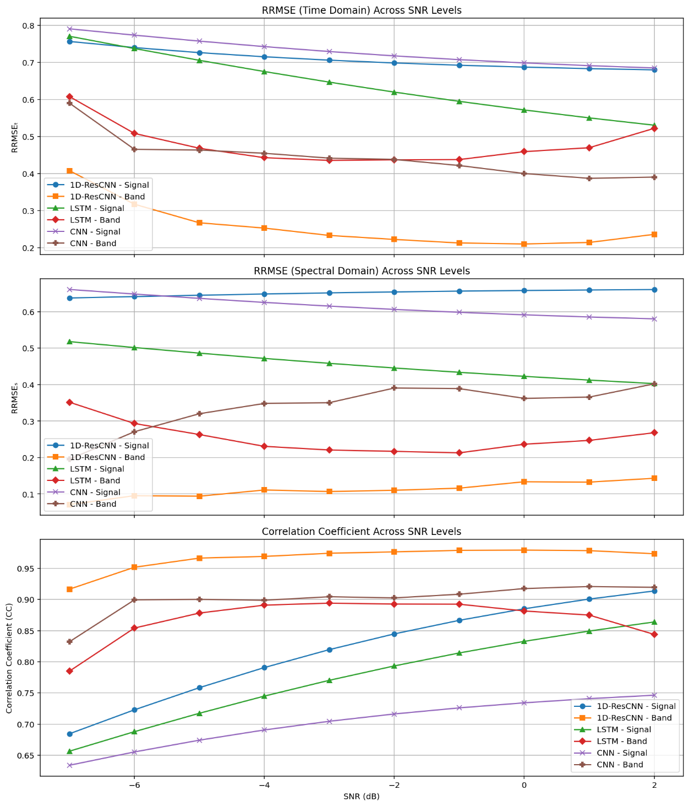

# Band2CleanFormer: Band-Specific EEG Denoising with Inter-Band Attention

[](https://www.python.org/downloads/)
[](https://pytorch.org/)

**Note:** This repository is currently under active development. Some features may be incomplete or subject to change.

Band2CleanFormer is a deep learning framework for electroencephalography (EEG) artifact removal that leverages frequency-aware processing through band-specific decomposition and inter-band attention mechanisms. Unlike traditional approaches that treat EEG as a single broadband signal, Band2CleanFormer explicitly models the frequency-structured nature of EEG by decomposing signals into six canonical frequency bands and processing them jointly through a CNN-Transformer hybrid architecture.

## Graphical Abstract



## Model Architecture



Band2CleanFormer consists of four main components:
1. **CNN Encoder**: Extracts local temporal patterns from multi-band inputs
2. **Positional Encoding**: Preserves temporal ordering for Transformer processing
3. **Transformer Encoder**: Models long-range dependencies and inter-band interactions
4. **Reconstruction Head**: Maps Transformer features to denoised single-channel output

## Key Features

- **Band-Specific Processing**: Decomposes EEG into six frequency bands (Delta, Theta, Alpha, Beta, Gamma, High Frequencies) for targeted artifact suppression
- **Inter-Band Attention**: Jointly processes all bands to model cross-band dependencies
- **CNN-Transformer Hybrid**: Combines local convolutional features with global self-attention
- **Superior Performance**: Achieves correlation coefficients >0.98 for EOG and >0.95 for EMG artifacts across challenging SNR regimes

## Installation

### Prerequisites

- Python 3.7 or higher
- CUDA-capable GPU (recommended) or CPU

### Setup

1. Clone the repository:
```bash
git clone https://github.com/nghianguyen7171/Band2CleanFormer.git
cd Band2CleanFormer
```

2. Install dependencies:
```bash
pip install -r requirements.txt
```

## Dataset Setup

This implementation is designed for the [EEGDenoiseNet](https://github.com/ncclabsustc/EEGdenoiseNet) benchmark dataset. The dataset is not included in this repository due to licensing restrictions.

### Dataset Structure

After downloading and preprocessing the EEGDenoiseNet dataset, organize your data as follows:

```
your_dataset_path/
├── eog/
│   ├── clean/
│   │   ├── Delta_band.npy
│   │   ├── Theta_band.npy
│   │   ├── Alpha_band.npy
│   │   ├── Beta_band.npy
│   │   ├── Gamma_band.npy
│   │   └── High_Frequencies_band.npy
│   └── Contaminated/
│       ├── SNR_-7/
│       │   ├── Delta_band.npy
│       │   └── ...
│       ├── SNR_-6/
│       └── ...
└── emg/
    ├── clean/
    └── Contaminated/
```

**Note:** The dataset requires preprocessing to decompose signals into frequency bands. Please refer to the paper for details on the FFT-based band decomposition procedure.

## Usage

### Training

#### Train on EOG-contaminated EEG:
```bash
python src/training/train_eog.py \
    --clean_dir /path/to/eog/clean/bands \
    --contaminated_dir /path/to/eog/contaminated/bands \
    --batch_size 128 \
    --epochs 200 \
    --lr 0.001 \
    --save_path checkpoints/band2cleanformer_eog.pth
```

#### Train on EMG-contaminated EEG:
```bash
python src/training/train_emg.py \
    --clean_dir /path/to/emg/clean/bands \
    --contaminated_dir /path/to/emg/contaminated/bands \
    --batch_size 128 \
    --epochs 100 \
    --lr 0.001 \
    --seq_len 1024 \
    --save_path checkpoints/band2cleanformer_emg.pth
```

### Configuration

You can also use the configuration file (`config/config.yaml`) to set hyperparameters. Update the paths in the config file and use it with the training scripts.

### Evaluation

The training scripts automatically evaluate the model on the test set and report:
- **RRMSE_t**: Relative Root Mean Squared Error in time domain
- **RRMSE_s**: Relative Root Mean Squared Error in frequency domain  
- **CC**: Pearson Correlation Coefficient

## Results

### EOG Artifact Removal



Band2CleanFormer achieves superior performance on EOG-contaminated EEG, with correlation coefficients exceeding 0.98 across SNR levels from -7 dB to +2 dB.

### EMG Artifact Removal



For EMG-contaminated EEG, Band2CleanFormer maintains correlation coefficients above 0.95, demonstrating robust artifact suppression while preserving neural oscillations.

## Project Structure

```
Band2CleanFormer/
├── src/
│   ├── models/              # Model definitions
│   │   └── band2cleanformer.py
│   ├── data/                # Data loading utilities
│   │   └── dataset.py
│   ├── training/            # Training scripts
│   │   ├── train_eog.py
│   │   ├── train_emg.py
│   │   └── train_utils.py
│   ├── evaluation/          # Evaluation metrics
│   │   └── metrics.py
│   └── utils/               # Utility functions
├── config/                  # Configuration files
│   └── config.yaml
├── notebooks/               # Reference notebooks
├── assets/                  # Images and figures
├── scripts/                 # Standalone scripts
├── examples/                # Example usage
├── requirements.txt         # Python dependencies
└── README.md
```

## Citation

If you use this code in your research, please cite:

```bibtex
@article{band2cleanformer2024,
  title={Band2CleanFormer: Integrating Band-Specific Processing and Inter-Band Attention for Robust EEG Denoising},
  author={Ulziisaikhan, Battulga and Nguyen, Trong-Nghia and Kim, Soo-Hyung},
  journal={[Journal Name]},
  year={2024}
}
```

## License

This project is licensed under the MIT License - see the LICENSE file for details.

## Acknowledgments

- This work uses the [EEGDenoiseNet](https://github.com/ncclabsustc/EEGdenoiseNet) benchmark dataset
- The implementation is based on the paper "Band2CleanFormer: Integrating Band-Specific Processing and Inter-Band Attention for Robust EEG Denoising"

## Contact

For questions or issues, please open an issue on GitHub or contact:
- **Corresponding Author**: Prof. Soo-Hyung Kim (shkim@jnu.ac.kr)
- **GitHub**: [nghianguyen7171](https://github.com/nghianguyen7171)
